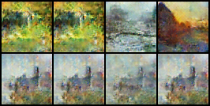
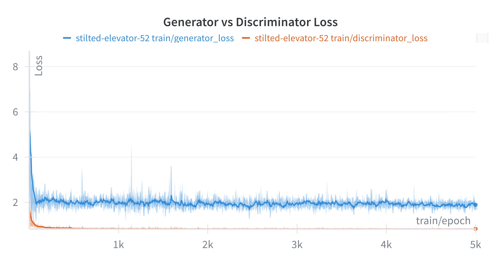

# DCGAN Monet Style Generation

A Deep Convolutional Generative Adversarial Network (DCGAN) implementation for generating Monet-style paintings. This project achieves high-quality artistic image synthesis with a final MiFID score of 1.47 after training for 5,000 epochs.

## Quick Start

```bash
# Install dependencies
uv sync

# Run exploratory data analysis
uv run python main.py eda

# Train the DCGAN model
uv run python main.py gan --epochs 1000 --use_wandb 1

# Generate submission images
uv run python generate_submission_images.py --num_images 8000
```

## Requirements

### Hardware
- **GPU**: NVIDIA GPU (CUDA) or Apple Silicon (MPS) recommended
- **RAM**: 8GB+ system memory
- **Storage**: Approximately 2GB for dataset and artifacts

### Software
- Python 3.9 or higher
- PyTorch 2.0.0 or higher with GPU support
- See `pyproject.toml` for complete dependency list

## Installation

### Using uv (Recommended)
```bash
# Clone the repository
git clone https://github.com/devmarkpro/dcgan-monet-style-kaggle.git
cd dcgan-monet-style-kaggle

# Install dependencies
uv sync

# Activate environment (if needed)
source .venv/bin/activate  # Linux/Mac
# or
.venv\Scripts\activate     # Windows
```

### Using pip
```bash
# Install in development mode
pip install -e .
```

## Usage

### 1. Exploratory Data Analysis (EDA)

Analyze the Monet dataset before training:

```bash
uv run python main.py eda [OPTIONS]
```

**EDA Options:**
- `--dataset_dir`: Path to dataset (default: `./data/monet/training/monet_jpg`)
- `--batch_size`: Batch size for analysis (default: 16)
- `--artifacts_folder`: Output directory (default: `./artifacts`)
- `--sample_size`: Number of images to analyze (default: 100)
- `--dpi`: Plot resolution (default: 150)

**Output:** Creates comprehensive analysis in `./artifacts/eda/` including:
- Dataset statistics
- Pixel distribution analysis
- Color analysis
- Image quality metrics
- Sample visualizations

### 2. Training the DCGAN

Train the generator and discriminator networks:

```bash
uv run python main.py gan [OPTIONS]
```

**Key Training Parameters:**
| Parameter                          | Default | Description                     |
| ---------------------------------- | ------- | ------------------------------- |
| `--epochs`                         | 100     | Number of training epochs       |
| `--batch_size`                     | 16      | Training batch size             |
| `--latent_size`                    | 128     | Latent vector dimension         |
| `--generator_feature_map_size`     | 64      | Generator feature maps          |
| `--discriminator_feature_map_size` | 64      | Discriminator feature maps      |
| `--generator_lr`                   | 0.0002  | Generator learning rate         |
| `--discriminator_lr`               | 0.0002  | Discriminator learning rate     |
| `--use_wandb`                      | 1       | Enable Weights & Biases logging |
| `--image_log_every_iters`          | 10      | Image logging frequency         |
| `--mifid_eval_every_epochs`        | 0       | MiFID evaluation frequency      |

**Example Training Commands:**
```bash
# Basic training
uv run python main.py gan --epochs 500

# Advanced training with monitoring
uv run python main.py gan --epochs 5000 --image_log_every_iters 100 --mifid_eval_every_epochs 100 --use_wandb 1

# Custom hyperparameters
uv run python main.py gan --epochs 2000 --batch_size 32 --latent_size 256 --generator_lr 0.0001
```

### 3. Generating Submission Images

Generate 7,000-10,000 Monet-style images for competition submission:

```bash
uv run python generate_submission_images.py [OPTIONS]
```

**Generation Parameters:**
| Parameter          | Default                           | Description                   |
| ------------------ | --------------------------------- | ----------------------------- |
| `--generator_path` | `./artifacts/generator_final.pth` | Path to trained generator     |
| `--output_dir`     | `./artifacts/submission_images`   | Output directory              |
| `--num_images`     | 8000                              | Number of images (7000-10000) |
| `--batch_size`     | 64                                | Generation batch size         |
| `--latent_size`    | 128                               | Latent vector size            |

**Example Generation Commands:**
```bash
# Default generation (8000 images)
uv run python generate_submission_images.py

# Custom parameters
uv run python generate_submission_images.py \
    --generator_path ./artifacts/generator_epoch_5000.pth \
    --output_dir ./my_submission \
    --num_images 9000 \
    --batch_size 32
```

### 4. Creating Training Animation

Use the Jupyter notebook to create animations showing training progress:

```bash
# Launch Jupyter
jupyter notebook

# Open main.ipynb
```

The notebook (`main.ipynb`) creates an animated GIF that shows how generated images develop during training:
- Loads saved sample arrays from `./artifacts/samples_*.npy`
- Creates frame-by-frame animation of the first sample across epochs
- Saves as `animation.gif` and displays in notebook
- Shows training progression from noise to realistic Monet-style paintings

### 5. Weights & Biases Integration

The project includes comprehensive WandB logging via `monet_wandb.py`:

**Features:**
- **Training Metrics**: Loss curves, discriminator accuracy, D(x) values
- **Image Logging**: Generated samples, real vs fake comparisons
- **System Metrics**: GPU memory usage, training time
- **MiFID Evaluation**: Automated quality assessment
- **Model Gradients**: Gradient flow monitoring

**Setup WandB:**
```bash
# Install wandb (included in dependencies)
wandb login

# Train with WandB enabled
uv run python main.py gan --use_wandb 1 --epochs 1000
```

**WandB Dashboard includes:**
- Real-time loss curves
- Generated image grids
- Training hyperparameters
- System performance metrics
- MiFID score evolution

## Results Summary

### Training Performance
- **Final MiFID Score**: 1.47 (excellent quality)
- **Training Time**: Approximately 63 minutes for 5,000 epochs on Apple Silicon
- **Architecture**: DCGAN with 64x64 training resolution
- **Upscaling**: LANCZOS resampling to 256x256 for submission

### Generated Samples
The model successfully learns Monet's impressionist style:


*Final generated samples after 5,000 epochs*


*Training loss evolution showing stable adversarial dynamics*

### Key Achievements
- Stable GAN training without mode collapse
- High-quality artistic style transfer
- Efficient training on consumer hardware
- Comprehensive monitoring and evaluation
- Production-ready image generation pipeline

## Project Structure

```
dcgan-monet-style-kaggle/
├── data/monet/training/monet_jpg/     # Training dataset (300 images)
├── artifacts/                         # Generated outputs and models
│   ├── eda/                          # EDA analysis results
│   ├── submission_images/            # Generated submission images
│   ├── generator_*.pth               # Trained generator models
│   └── samples_*.npy                 # Training samples for animation
├── report_material/                  # Training visualizations and plots
├── main.py                          # Primary CLI interface
├── main.ipynb                       # Animation creation notebook
├── generate_submission_images.py    # Submission image generator
├── dcgan.py                         # Main DCGAN training logic
├── generator.py                     # Generator network definition
├── discriminator.py                 # Discriminator network definition
├── dataset.py                       # Data loading and preprocessing
├── monet_wandb.py                   # Weights & Biases integration
├── configs.py                       # Configuration parameters
├── device.py                        # Device detection utilities
├── logger.py                        # Logging functionality
├── utils.py                         # Utility functions
├── eda.py                          # Exploratory data analysis
├── pyproject.toml                   # Dependencies and project config
└── README.md                        # This file
```

## Troubleshooting

### Common Issues

**CUDA/MPS Not Available:**
```bash
# Check device detection
python -c "from device import get_device_info; print(get_device_info())"
```

**Out of Memory:**
- Reduce `--batch_size` (try 8 or 4)
- Reduce `--generator_feature_map_size` and `--discriminator_feature_map_size`

**Training Instability:**
- Adjust learning rates: `--generator_lr 0.0001 --discriminator_lr 0.0002`
- Enable label smoothing: `--label_smoothing_real 0.9`

**WandB Issues:**
```bash
# Re-authenticate
wandb login

# Disable if needed
uv run python main.py gan --use_wandb 0
```

## Additional Resources

- **Detailed Report**: See [REPORT.md](REPORT.md) for comprehensive technical analysis
- **Original Paper**: [Unsupervised Representation Learning with DCGANs](https://arxiv.org/abs/1511.06434)
- **Competition**: [Kaggle GAN Getting Started](https://www.kaggle.com/competitions/gan-getting-started)
